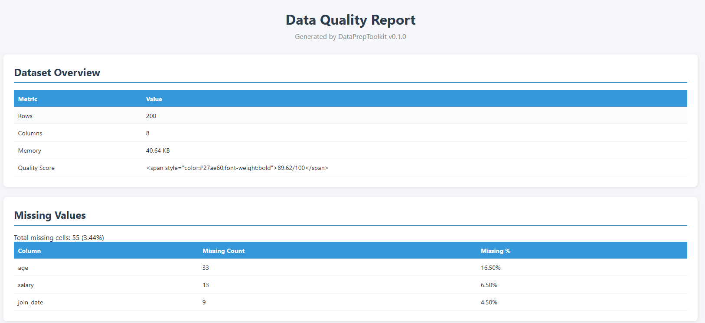
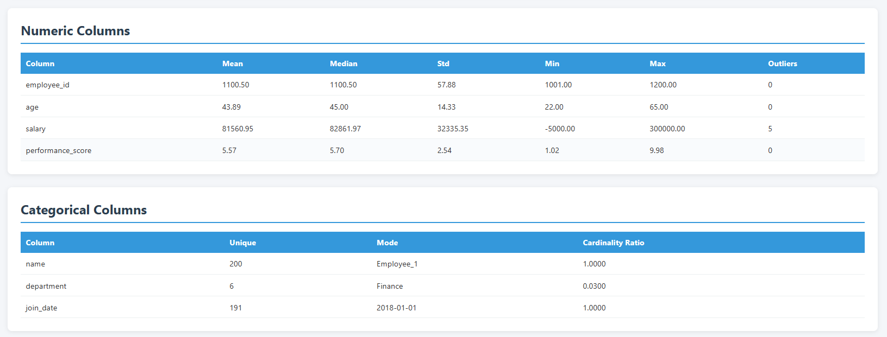
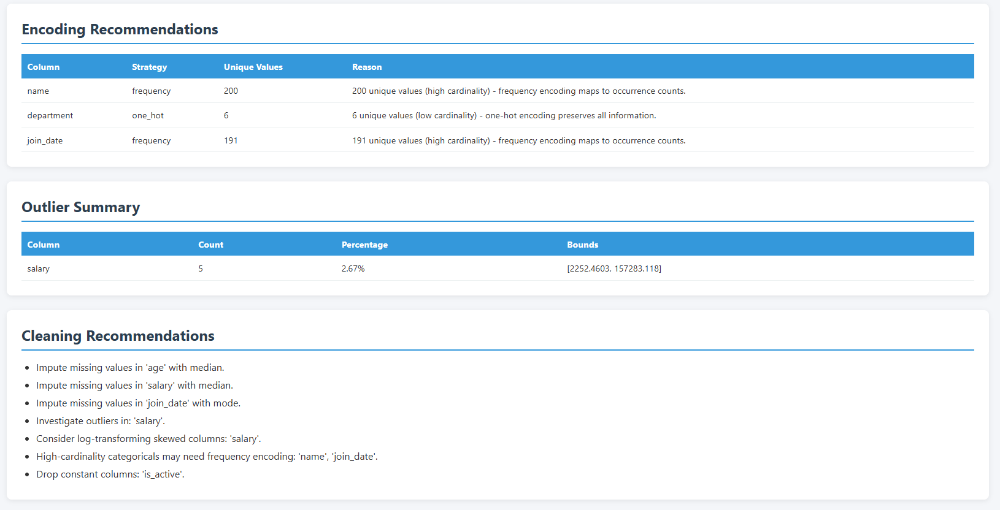

# DataPrepToolkit

<p align="center">
  
  
  
  
  
  
  
</p>

<p align="center">
  <strong>Automated Data Preprocessing, Profiling, and Quality Reporting</strong>
</p>

<p align="center">
  <a href="#installation">Installation</a> |
  <a href="#quick-start">Quick Start</a> |
  <a href="#features">Features</a> |
  <a href="#api-reference">API Reference</a> |
  <a href="#examples">Examples</a>
</p>

---

## Why This Project?

Many data analysis projects begin by rewriting the same preprocessing code: checking for missing values, handling duplicates, optimizing memory, validating data types, and generating quality reports.

**DataPrepToolkit** was built to provide a reusable, production-quality preprocessing pipeline that standardizes data loading, validation, cleaning, optimization, and reporting.

The project emphasizes **software engineering best practices** rather than exploratory analysis or machine learning. Every module is typed, documented, tested (171 unit tests), and follows SOLID principles.

## Overview

DataPrepToolkit is a production-quality Python package that automates the most common data preprocessing tasks performed before exploratory analysis, business intelligence reporting, or machine learning workflows.

Instead of writing repetitive cleaning code for every project, use DataPrepToolkit to:

- **Load** and **profile** your dataset in one line
- **Validate** data against business rules
- **Clean** missing values, duplicates, and invalid data
- **Optimize** memory usage with automatic type downcasting
- **Detect** outliers using statistical methods
- **Report** data quality with professional HTML/CSV exports

## Installation

```bash
pip install datapreptoolkit
```

For development:

```bash
git clone https://github.com/Arasoul/DataPrepToolkit.git
cd DataPrepToolkit
pip install -e ".[dev]"
```

## Quick Start

```python
from datapreptoolkit import load_csv, generate_quality_report, export_html_report

# Load your data
df = load_csv("your_data.csv")

# Generate a complete quality report
report = generate_quality_report(df)
report.overall_quality_score  # e.g. 95.54

# Export as professional HTML report
export_html_report(report, "reports/quality_report.html")
```

## Features

### 1. Load Data

```python
from datapreptoolkit import load_csv, load_dataframe

# From CSV file
df = load_csv("data.csv")

# From existing DataFrame
df = load_dataframe(your_df)
```

### 2. Profile Dataset

```python
from datapreptoolkit import profile_dataset

profile = profile_dataset(df)

profile.shape              # (1000, 12)
profile.memory_human       # "456.78 KB"
profile.overall_quality_score  # 92.62
profile.missing_columns    # ["age", "salary"]
profile.duplicate_rows     # 3
```

### 3. Validate Data

```python
from datapreptoolkit import validate_dataset, ValidationRule

rules = [
    ValidationRule(column="age", rule_type="range", min_value=0, max_value=120),
    ValidationRule(column="email", rule_type="regex", pattern=r"^[\w.-]+@[\w.-]+\.\w+$"),
    ValidationRule(column="id", rule_type="no_duplicates"),
    ValidationRule(column="status", rule_type="in_set", allowed_values={"active", "inactive"}),
    ValidationRule(column="name", rule_type="not_null"),
]

result = validate_dataset(df, rules)
result.is_valid       # False
result.failed_rules   # 2
```

**Supported Rule Types:**

| Rule Type | Description | Parameters |
|-----------|-------------|------------|
| `range` | Values within [min, max] | `min_value`, `max_value` |
| `regex` | Match pattern | `pattern` |
| `not_null` | No null values | - |
| `no_duplicates` | All values unique | - |
| `required` | Column must exist | - |
| `in_set` | Values in allowed set | `allowed_values` |

### 4. Clean Data

```python
from datapreptoolkit import handle_missing_values, remove_duplicates, clean_dataset

# Handle missing values
df_cleaned, result = handle_missing_values(df, strategy="median")

# Available strategies:
# "mean", "median", "mode", "ffill", "bfill",
# "interpolate", "drop_rows", "drop_column", "zero", "empty"

# Remove duplicates
df_deduped, result = remove_duplicates(df_cleaned)

# Run full pipeline
df_final, result = clean_dataset(df)
```

### 5. Optimize Memory

```python
from datapreptoolkit import optimise_memory

df_optimized, result = optimise_memory(df)

result.memory_before_human  # "1.23 MB"
result.memory_after_human   # "0.89 MB"
result.savings_mb           # 0.34
result.savings_pct          # 27.6
```

**Optimizations applied:**
- `int64` -> `int8`/`int16`/`int32` (when range fits)
- `float64` -> `float32`
- `object` -> `category` (low-cardinality columns)

### 6. Detect Outliers

```python
from datapreptoolkit import detect_outliers

result = detect_outliers(df, method="iqr")

result.total_outliers            # 15
result.columns_with_outliers     # ["salary", "age"]

for name, info in result.columns.items():
    if info.outlier_count > 0:
        info.outlier_count       # 5
        info.outlier_pct         # 2.5
        info.lower_bound         # -21478.89
        info.upper_bound         # 171939.35
```

**Detection Methods:**
- **IQR**: Interquartile Range (default, `1.5 * IQR`)
- **Z-Score**: Standard or Modified (MAD-based)

### 7. Generate Reports

```python
from datapreptoolkit import generate_quality_report, export_html_report, export_csv_summary

report = generate_quality_report(df)

# Professional audit-style HTML report
export_html_report(report, "reports/quality_report.html")

# CSV summary with per-column statistics
export_csv_summary(report, "reports/quality_summary.csv")
```

**Report Sections:**
- Dataset Overview (shape, memory, quality score)
- Missing Values Analysis
- Numeric Column Statistics
- Categorical Column Statistics
- Encoding Recommendations
- Outlier Summary
- Cleaning Recommendations

## Quality Scoring

The quality score is fully configurable through `ToolkitConfig`:

```python
from datapreptoolkit import ToolkitConfig

config = ToolkitConfig(
    quality_weights={
        "missing": 40.0,
        "duplicate": 20.0,
        "constant": 2.0,
        "high_cardinality": 1.0,
        "outlier": 3.0,
    }
)

report = generate_quality_report(df, config)
report.overall_quality_score  # 89.62
```

## Configuration

`ToolkitConfig` provides central control over all behavior:

```python
from datapreptoolkit import ToolkitConfig, EncodingStrategy, ZScoreMethod

config = ToolkitConfig(
    # Duplicate handling
    remove_duplicates=True,

    # Datetime parsing
    parse_datetimes=True,

    # Memory optimization
    optimise_memory=True,

    # Outlier detection
    detect_outliers=True,
    outlier_method="iqr",        # "iqr" or "zscore"
    iqr_multiplier=1.5,
    zscore_threshold=3.0,

    # Encoding
    encoding_strategy=EncodingStrategy.LABEL,

    # Thresholds
    high_cardinality_threshold=0.95,
    constant_threshold=0.99,

    # Reporting
    report_dir="reports",

    # Quality scoring weights
    quality_weights={
        "missing": 40.0,
        "duplicate": 20.0,
        "constant": 2.0,
        "high_cardinality": 1.0,
        "outlier": 3.0,
    },
)
```

## Architecture

```
DataPrepToolkit/
├── src/datapreptoolkit/
│   ├── __init__.py        # Public API surface
│   ├── config.py          # ToolkitConfig, enums
│   ├── exceptions.py      # Custom exception hierarchy
│   ├── utils.py           # Stateless helpers
│   ├── loader.py          # CSV/DataFrame loading, profiling
│   ├── analyzer.py        # Missing values, numeric, categorical analysis
│   ├── cleaner.py         # Imputation, deduplication, validation
│   ├── optimizer.py       # Memory/dtype optimization
│   ├── outliers.py        # IQR, Z-score outlier detection
│   ├── validator.py       # Rule-based data validation
│   └── reporter.py        # Quality scoring, HTML/CSV export
├── tests/                 # 171 unit tests
├── examples/
│   └── full_workflow.ipynb   # Complete workflow demo
├── reports/               # Generated reports
├── screenshots/           # Report screenshots
├── pyproject.toml
├── requirements.txt
├── README.md
├── LICENSE
├── CHANGELOG.md
└── CONTRIBUTING.md
```

## Screenshots

### Dataset Overview & Missing Values



### Numeric & Categorical Analysis



### Encoding, Outliers & Recommendations



## API Reference

### Loader
- `load_csv(filepath, encoding)` - Load CSV file
- `load_dataframe(df)` - Load from existing DataFrame
- `profile_dataset(df, config)` - Generate DatasetProfile

### Analyzer
- `analyze_missing_values(df, config)` - Missing value analysis
- `analyze_numeric_columns(df, config)` - Numeric statistics
- `analyze_categorical_columns(df, config)` - Categorical frequencies
- `generate_feature_summaries(df, config)` - Per-column summaries

### Cleaner
- `handle_missing_values(df, strategy, config)` - Impute/drop missing
- `parse_datetimes(df, columns, config)` - Parse datetime columns
- `remove_duplicates(df, subset, config)` - Remove duplicate rows
- `detect_invalid_values(df, rules, config)` - Find invalid values
- `clean_dataset(df, config)` - Run full cleaning pipeline

### Optimizer
- `optimise_datatypes(df, config)` - Down-cast types
- `optimise_memory(df, config)` - High-level memory optimization

### Outliers
- `detect_outliers(df, method, config)` - Auto-detect outliers
- `detect_outliers_iqr(df, config)` - IQR method
- `detect_outliers_zscore(df, threshold, method, config)` - Z-score method

### Validator
- `validate_dataset(df, rules, config)` - Validate against rules

### Reporter
- `generate_quality_report(df, config)` - Generate QualityReport
- `generate_encoding_recommendations(df, config)` - Encoding suggestions
- `export_html_report(report, filepath, config)` - Export HTML
- `export_csv_summary(report, filepath, config)` - Export CSV

## Testing

```bash
# Run all tests
python -m pytest tests/ -v

# Run with coverage
python -m pytest tests/ --cov=datapreptoolkit --cov-report=html
```

## Requirements

- Python 3.11+
- pandas >= 2.1.0
- numpy >= 1.25.0

## Changelog

See [CHANGELOG.md](CHANGELOG.md) for release history.

## Contributing

See [CONTRIBUTING.md](CONTRIBUTING.md) for guidelines.

## License

MIT License - see [LICENSE](LICENSE) for details.

## Author

**Ahmed** - [GitHub](https://github.com/Arasoul)
